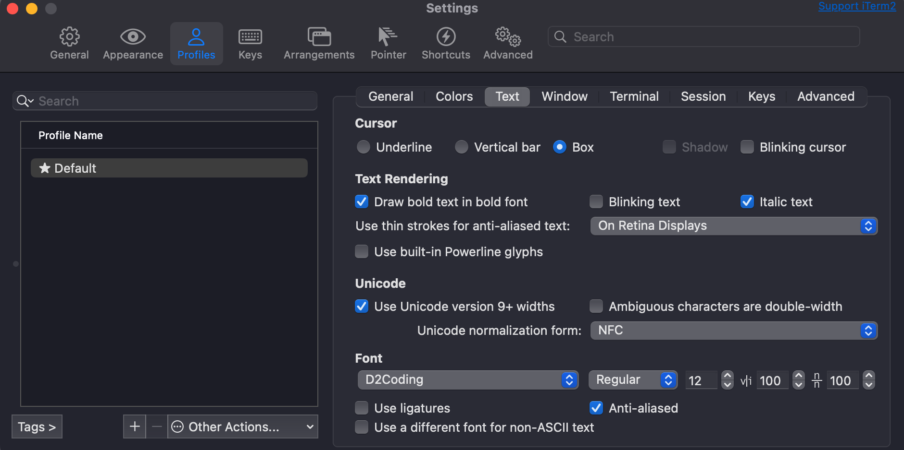

# Terminal
## Homebrew
### 설치
```shell
/bin/bash -c "$(curl -fsSL https://raw.githubusercontent.com/Homebrew/install/HEAD/install.sh)"
```
<br/>

### 환경 변수 설정
```shell
vi ~/.zshrc
```
```shell
# Homebrew
export PATH=/opt/homebrew/bin:$PATH
```
```shell
source ~/.zshrc
```
<br/>
<br/>

## iTerm2 설치
```shell
brew install iterm2
```
<br/>
<br/>

## Oh My Zsh
```shell
sh -c "$(curl -fsSL https://raw.githubusercontent.com/ohmyzsh/ohmyzsh/master/tools/install.sh)"
```
```shell
brew install zsh-syntax-highlighting
```
```shell
brew install zsh-autosuggestions
```
```shell
brew install font-d2coding
```
<br/>

### 환경 변수 설정
```shell
vi ~/.zshrc
```
```shell
# Oh My Zsh
export ZSH="$HOME/.oh-my-zsh"
ZSH_THEME="agnoster"
plugins=(git)
source $ZSH/oh-my-zsh.sh

# Syntax Highlighting
source /opt/homebrew/share/zsh-syntax-highlighting/zsh-syntax-highlighting.zsh

# Auto Suggestion
source /opt/homebrew/share/zsh-autosuggestions/zsh-autosuggestions.zsh

# Remove User Name
prompt_context() {
    if [[ "$USER" != "$DEFAULT_USER" || -n "$SSH_CLIENT" ]]; then
        prompt_segment black default "%(!.%.)$USER"
    fi
}
DEFAULT_USER="유저 이름"
```
```shell
source ~/.zshrc
```
<br/>

### 폰트 설정
<br/>
